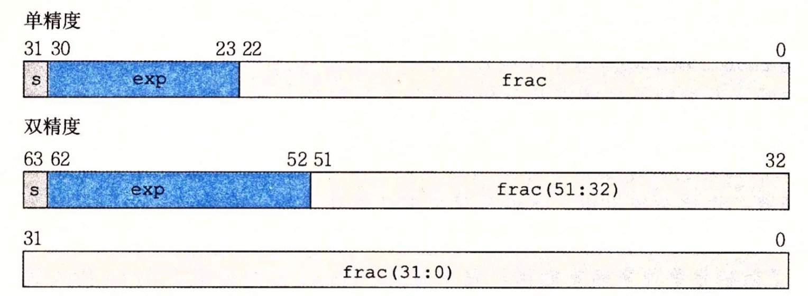

# 读CSAPP(1) - 信息的表示和处理

## 计算机存的什么
计算机存储的是二进制，每一位存储的是0或1。大多数计算机使用1字节（也就是8位），作为最小可寻址的内存单位。
每个字节都有一个唯一的数字来标识，也就是地址（address）。每个计算机都有一个字长（word size），也就是常说的64位操作系统，32位操作系统。字长决定了虚拟地址空间的大小，
比如32位有4GB的内存空间，64位则是16EB（1TB = 1024GB，1 EB = 1,024 PB = 1,048,576 TB）。

## 整数 
### 原码，反码，补码
计算机存储的是二进制，现实中数字有正负之分，二进制如果想表示正负数怎么办呢？
为了解决**正负数问题**于是有了 **原码** ，原码的表示方式是：**第一位不再表示有效位，而是符号位，0代表正数，1代表负数**

[1001] 这个8位二进制，本该表示 十进制的9，现在他表示为 -1，第一位（1）是符号位，后面的才是真正的值。

| 正数 | 二进制 | 负数 | 二进制 |
| ---- | ------ | ---- | ------ |
| +0   | 0000   | -0   | 1000   |
| +1   | 0001   | -1   | 1001   |
| +2   | 0010   | -2   | 1010   |
| +3   | 0011   | -3   | 1011   |
| +4   | 0100   | -4   | 1100   |
| +5   | 0101   | -5   | 1101   |
| +6   | 0110   | -6   | 1110   |
| +7   | 0111   | -7   | 1111   |

现在计算机可以存储负数了，我们进行运算操作：

- 十进制：1+1 = 2 ； 二进制则是：0001+0001 = 0010
- 十进制：1 + （-1） = 0；二进制则是：0001+1001 = 1010 结果是-2

1+（-1）时结果会出现问题。 虽然原码表示了正负数，运算却有问题。
为了解决**正负数相加问题**于是有了**反码**，反码的表示方式是：**在原码的基础上，正数的反码是其本身，负数的反码是符号位不变，有效位取反**

| 正数 | 二进制 | 负数 | 二进制 |
| ---- | ------ | ---- | ------ |
| +0   | 0000   | -0   | 1111   |
| +1   | 0001   | -1   | 1110   |
| +2   | 0010   | -2   | 1101   |
| +3   | 0011   | -3   | 1100   |
| +4   | 0100   | -4   | 1011   |
| +5   | 0101   | -5   | 1010   |
| +6   | 0110   | -6   | 1001   |
| +7   | 0111   | -7   | 1000   |

现在我们看看正负数相加：

- 十进制：1 + （-1） = 0；二进制则是：0001+1110 = 1111 ，正好对应反码表里的 -0

这样就解决了正负数相加的问题，但现在还有一个问题： 0 有两种表示方式：0000和1111，现实中0是不分正负的，计算机也需要解决，否则判断是否为0还需要判断两次（+0和-0）。为了解决**0有两种表示类型** 于是有了 **补码**，补码的表示方式是：**在反码基础上，正数不变， 负数+1**

| 正数 | 二进制 | 负数 | 二进制 |
| ---- | ------ | ---- | ------ |
| +0   | 0000   | -0   | 0000   |
| +1   | 0001   | -1   | 1111   |
| +2   | 0010   | -2   | 1110   |
| +3   | 0011   | -3   | 1101   |
| +4   | 0100   | -4   | 1100   |
| +5   | 0101   | -5   | 1011   |
| +6   | 0110   | -6   | 1010   |
| +7   | 0111   | -7   | 1001   |
| --   | --     | -8   | 1000   |

- 原本1111表示-0，+1后： 1111+0001 = 10000，补位后溢出不计入，所以最终结果是0000
- 1000没有人用，于是就给了-8

现在正负0的二进制形式都为0000，并且还多出了一个表示数字-8
再来计算一下正负数相加：

- 十进制：1 + （-1） = 0；二进制则是：0001+1111 = 10000 ，溢出不计入，最终结果0000

### 运算溢出
如果存储大小为4位，取值范围就是[1000, 0111] -8 ~ 7。

正溢出：

- 十进制：5+5 = 10， 二进制0101+0101 = 1010（十进制结果-6），因为溢出导致将原来符号位的0改成了1，结果变成了负数。

负溢出：

- 十进制-5 + （-5）=-10，二进制1011+1011 = 0110（十进制结果6），溢出位不计入，最终因为溢出导致将原来符号位的1改成了0，结果变成了正数

### 有符号与无符号的转换
在c语言中整型加上unsigned来表示无符号整数。这样的话补码[1000，01111] 的范围是-8 ~ 7，去掉符号位的话就是[0000，1111] 0~15。

无符号转换成有符号

| 十进制 | 无符号 | 有符号 | 最终十进制结果 |
| ------ | ------ | ------ | -------------- |
| 1      | 0001   | 0001   | 1              |
| 15     | 1111   | 1111   | -1             |

有符号转换成无符号

| 十进制 | 有符号 | 无符号 | 最终十进制结果 |
| ------ | ------ | ------ | -------------- |
| 1      | 0001   | 0001   | 1              |
| -8     | 1000   | 1000   | 8              |
| -1     | 1001   | 1111   | 15             |

### 扩展与截断数字
#### 扩展（例如从 4位 到 8位）
c语言中short转换为int的操作，小字节转换到大字节，不会对原数据造成丢失

- 无符号数：加 0

| 转换前的十进制 | 4位  | 8位        | 转换后的十进制 |
| -------------- | ---- | ---------- | -------------- |
| 1              | 0001 | 0000，0001 | 1              |
| 15             | 1111 | 0000，1111 | 15             |

- 有符号数：加符号位

| 转换前的十进制 | 4位  | 8位        | 转换后的十进制 |
| -------------- | ---- | ---------- | -------------- |
| -1             | 1001 | 1111，0001 | -1             |
| -8             | 1000 | 1111，1000 | -8             |

#### 截取：
如果将w位转为k位，其中w>k，则取后k位，移除 高位 w ~ k 的位。例如 8位 到 4位：则移除前4位，保留后4位。所以可能会丢失高位的数据，导致结果有问题

- 无符号数：直接保留后四位

| 转换前的十进制 | 8位        | 4位  | 转换后的十进制 |
| -------------- | ---------- | ---- | -------------- |
| 17             | 0001，0001 | 0001 | 1              |
| 255            | 1111，1111 | 1111 | 15             |

- 有符号数：保留后四位，第一位表示符号位（结果是补码）

| 转换前的十进制 | 8位        | 4位  | 转换后的十进制 |
| -------------- | ---------- | ---- | -------------- |
| -9             | 1000，1001 | 1001 | -7             |
| -15            | 1000，1111 | 1111 | -1             |

## 浮点数的表示

### 浮点数在二进制中的存储方式
十进制中 +100.05 可以用科学计数法表示成 +1.0005*$10^2$。这样的话我们就可以根据科学计数法，在二进制中存储了。

将位分成三份存储上面 的值：符号位(0)，整数位（10005），阶数位（2）。最后因为是二进制，计算的时候把$10^n$改成$2^n$。

根据国际标准IEEE 754，任意一个二进制浮点数V可以表示成下面的形式：

V=$(−1)^s$*𝑀*$2^E$

- $(-1)^s$表示符号位，当s=0，V为正数；当s=1，V为负数。
- M表示有效数字，大于等于1，小于2。
- E表示指数位

M：二进制中M的第一位总是1，所以IEEE 754规定，这个数字可以忽略，在运算的时候再添上。这样对于32位浮点数，就有24位有效数字，64位则有53位。增加了表示范围
E：E 是无符号的，如何表示负数，也就是 2^-n 这种形式？ 实际的E表示为 E = e - Baic。其中e是无符号数，Baic=2^(k-1)-1。以32位浮点数为例，e的范围在0~255，Baic = 127，E的范围就是-126~+127。

### 阶码（E）的值决定了 这个数是规格化，非规格化或者特殊值。

- 规格化：当阶码域不全为0时，或者不全为1时，得到真实值，再将有效数字M前加上第一位的1
- 非规格化：阶码域全为0，小数域不再补上1，这样做是为了表示±0，以及接近于0的很小的数字
- 特殊值：当阶码全为1，小数域全为0的时候，根据s的值，表示为 + \infty，- \infty。如果小数域不全为0，则为NaN

## 大小端
数据在内存中的存储顺序方式有大小端之分。

举例：如果int类型的x 存储在0x100的位置，十六进制表示：0x01234567 ，根据大小端有两种不同存储方式：

- 大端： 按照最高有效位（这里是01）到最低有效位的顺序存储

| 0x100 | 0x200 | 0x300 | 0x400 |
| ----- | ----- | ----- | ----- |
| 01    | 23    | 45    | 67    |

- 小端：按照最低有效位（这里是67）到最高有效位的顺序存储

| 0x100 | 0x200 | 0x300 | 0x400 |
| ----- | ----- | ----- | ----- |
| 67    | 45    | 23    | 01    |

一般在应用层开发无需在意大小端，字节顺序不可见。只有在网络传输的时候，大端机器传输给小端机器，或者反过来时，才会有大小端转换问题。

## 总结
计算机内存有限，溢出是必须考虑的事情。整数用补码形式存放于计算机，便于进行数值计算。两个数进行计算，当超出类型的字节范围，就会有溢出问题，造成程序异常。一个数据的存放在内存的顺序有大小端之分。

## 参考
[张子秋的博客](https://www.cnblogs.com/zhangziqiu/archive/2011/03/30/ComputerCode.html)

[插画-李俊达的回答 - 知乎](https://www.zhihu.com/question/20159860/answer/71256667)

[wdxtub 博客](https://wdxtub.com/csapp/thin-csapp-1/2016/04/16/)

[阮一峰 浮点数](http://www.ruanyifeng.com/blog/2010/06/ieee_floating-point_representation.html)

> 痛苦分两种，一种毫无意义，一种让人更坚强。 -- 《纸牌屋》

