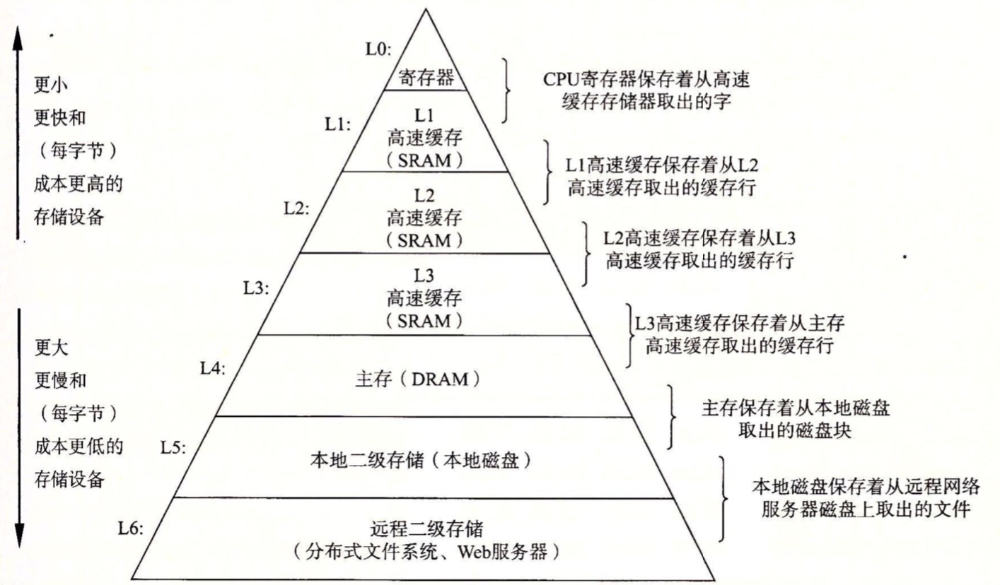

# 读CSAPP(3) - 存储器层次结构


## 了解硬件
### 随机访问存储器（Random-Access Memory，RAM）
RAM分两类，静态（SRAM）的和动态的（DRAM），SRAM要比DRAM更快，价格也更高。
SRAM用于高速缓存存储器，可以在cpu芯片上，也可以在片下。DRAM用来作为主存以及
图形系统的帧缓冲区。无论哪种RAM一旦断电，所有信息都会丢失。

### 磁盘存储
磁盘存储数据的数量级更大，比RAM大得多，但读取信息要比DRAM慢10w倍，比SRAM慢100w倍。
磁盘分为机械硬盘和固态硬盘，机械硬盘的读写速度要低于固态硬盘，但价格低廉。

### 总线


#### IO总线：例如，鼠标键盘，图形卡，磁盘等设备连接的称为io总线

cpu使用内存映射I/O技术（memory-mapped I/O）来向I/O设备发起命令

- 使用内存映射技术向io设备发起命令
- 磁盘控制器接收到命令，读取扇区，并执行到主存的DMA传送，磁盘进行直接内存访问的操作叫做DMA（Direct Memory Access）
- DMA传送完毕，磁盘控制器用中断方式通知cpu
- cpu接收到中断信号，从内存读取缓存的数据

## 局部性
一个好的程序应该有良好的局部性，这样可以使得效率更快

- 时间局部性：被引用过一次的内存，很可能在不久的将来再次被引用多次
- 空间局部性：如果一个内存位置被引用了一次，那么程序再不久的将来可能会引用其附近的内存位置

看一个例子
```c
int sumvec(int v[N])
{
    int i , sum = 0;
    for(i = 0; i < N; i ++)
        sum+=v[i];
    
    return sum;
}
```
这个函数中，sum就有很好的时间局部性，在多次循环中，会一直访问同一个内存位置，因为是标量所以没有空间局部性。
数组v被顺序读取，读取第i个位置，那么附近的位置也会在下次循环中读取，所以有很好的空间局部性，但每个变量只访问一次，所以时间局部性很差。
这个函数中要么有好的时间局部性，要么有好的空间局部性，所以sumvec函数有良好的局部性。

再看一个例子：
```c
int sumarray1(int a[M][N])
{
    int i ,j , sum = 0;
    for(i = 0;i < M ;i ++)
        for(j = 0; j < N ;j ++)
            sum+=a[i][j];
    
    return sum;
}

int sumarray2(int a[M][N])
{
    int i ,j , sum = 0;
    for(i = 0;i < N;i ++)
        for(j = 0; j < M ;j ++)
            sum+=a[i][j];

    return sum;
}

```
两个程序做的事情一模一样，效率看起来也是一样的。但根据局部性原理：
sumarray1有空间局部性，sumarry2则没有。
这个二维数组存储在内存的顺序是一行行的存储，也就是按照行来读就会按序读取，按列读取就会跳着读。
空间局部性的临近读取，导致最终sumarry1更高效。

### 局部性总结
- 重复引用相同变量的程序有良好的时间局部性
- 在内存中大跨度跳来跳去的程序，空间局部性会很差
- cpu取指执行的时候，循环遍历有好的空间局部性和时间局部性。循环体越小，循环次数越多，局部性越好


## 存储结构


| 缓存类型       | 缓存内容  | 缓存在何处        | 延迟(时钟周期) | 管理           |
| -------------- | --------- | ----------------- | -------------- | -------------- |
| CPU寄存器      | 4或8 字节 | 芯片上的cpu寄存器 | 0              | 编译器         |
| TLB            | 地址翻译  | 芯片上的TLB       | 0              | 内存管理单元   |
| L1 高速缓存    | 64 字节块 | 芯片上的L1 缓存   | 4              | 硬件           |
| L2 高速缓存    | 64 字节块 | 芯片上的L2 缓存   | 10             | 硬件           |
| 虚拟内存       | 4 KB 页   | 主存              | 100            | 硬件+OS        |
| 缓冲区缓存     | 部分文件  | 主存              | 100            | OS             |
| 磁盘缓存       | 磁盘扇区  | 磁盘控制器        | 100,000        | 磁盘固件       |
| 网络缓冲区缓存 | 部分文件  | 本地磁盘          | 10,000,000     | NFS 客户端     |
| 浏览器缓存     | web页     | 本地磁盘          | 10,000,000     | Web浏览器      |
| Web 缓存       | web页     | 远程服务器磁盘    | 1,000,000,000  | Web 代理服务器 |


下一层的存储器都是为上一层做缓存的，如果想要获取某个数据对象d，在k层则是缓存命中，如果没有则需要去k+1层查询，查询到后放入k层。
如果这时候k层数据已满就会可能覆盖现在的存储空间块，有专门的替换策略来将新数据替换原先数据。这种多级存储体系将几种存储技术结合起来，更好的解决存储器大容量、高速度和低成本这三者之间的矛盾

### 缓存不命中
当前存储器中获取不到数据，则需要向下级进行获取，这就是缓存不命中，主要有三种：

- 强制性不命中（Cold/compulsory Miss）：当缓存区域没有任何数据的时候（冷缓存），这时候获取任何数据都是不命中的，这是无法避免的
- 冲突性不命中（conflict miss）：如果k层容纳4个数据块， k+1层容纳12个，放置策略导致k+1层的0，4，8，12位置的数据都会放入k层的0块位置，不同cache由于index相同互相替换
- 容量失效(Capacity Miss)：有限的容量放不下大的缓存内容，被替换出去的下次再被访问，无法命中
